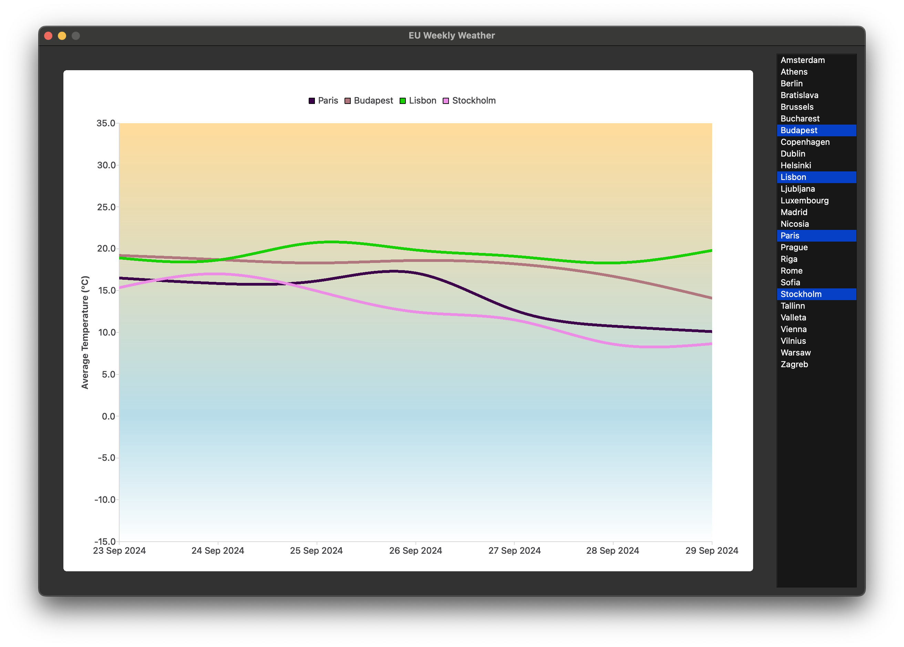

# EU-Weekly-Weather

This is an application written in Python for PyQT, that offers a visualisation of the average temperature in the 27 EU capital cities for the week to come.
All the data comes from [Open-Meteo](https://open-meteo.com/).

## Dependencies
- [PyQT](https://doc.qt.io/qtforpython-6/)

## Installation
MacOS/ Linux
```
python -m venv env
source env/bin/activate
pip install pyside6
```
Windows
```
python -m venv env
env\Scripts\activate.bat
pip install pyside6
```

## Running
```
python src/main.py
```

## Deployment
```
pyside6-deploy src/main.py
```


